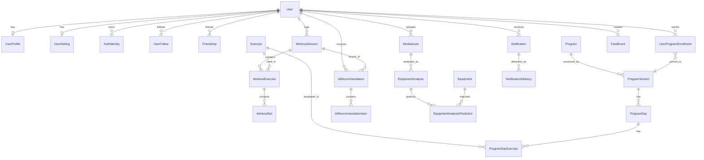

# STRONGER Production DB 설계

## 1. 설계 원칙

이 서비스는 아래 특징이 있습니다.

- 회원 수가 늘어날 수 있음
- 운동 기록은 세트 단위로 대량 누적됨
- AI 추천 결과와 근거 로그를 남겨야 함
- 루틴 / 프로그램은 버전 고정이 필요함
- 친구 / 팔로우 / 알림이 붙음
- 이미지 업로드와 장비 인식 결과가 붙음

그래서 DB 설계 원칙은 아래처럼 가져갑니다.

1. 계정 / 마스터 데이터는 `UUID`
2. 대량 적재 이벤트 테이블은 `BigInt autoincrement`
3. 무게 / 볼륨은 `Decimal` 대신 `정수 단위`로 저장
4. 추천 입력 / 출력 로그는 `JSONB`로 스냅샷 저장
5. 통계 조회용 집계 테이블을 별도로 둠
6. 루틴은 `Program`과 `ProgramVersion`을 분리
7. 이미지 원본은 오브젝트 스토리지에 저장하고 DB에는 메타데이터만 저장

## 2. ERD 구조



## 3. 테이블 목록

도메인 기준으로 보면 아래처럼 나뉩니다.

### 회원 / 인증
- `User`
- `UserProfile`
- `UserSetting`
- `AuthIdentity`

### 소셜
- `UserFollow`
- `Friendship`
- `FeedEvent`

### 운동 마스터 / 루틴
- `Exercise`
- `ExerciseMuscle`
- `Equipment`
- `ExerciseEquipment`
- `Program`
- `ProgramVersion`
- `ProgramDay`
- `ProgramDayExercise`
- `UserProgramEnrollment`

### 운동 기록
- `WorkoutSession`
- `WorkoutExercise`
- `WorkoutSet`
- `UserExerciseStat`
- `UserWorkoutDailyStat`
- `UserWorkoutWeeklyStat`

### AI 추천
- `AiRecommendation`
- `AiRecommendationItem`
- `AiRecommendationAction`

### 이미지 / 장비 인식
- `MediaAsset`
- `EquipmentAnalysis`
- `EquipmentAnalysisPrediction`

### 알림
- `UserPushDevice`
- `Notification`
- `NotificationDelivery`

## 4. 각 테이블 상세

### 4-1. User

| 컬럼 | 타입 | 설명 |
|---|---|---|
| id | uuid | 사용자 PK |
| email | varchar(320) | 원본 이메일 |
| emailNormalized | varchar(320) | lower-case 이메일, unique 기준 |
| passwordHash | varchar(255), nullable | 로컬 로그인용 |
| role | enum(UserRole) | USER / ADMIN / MODERATOR |
| status | enum(UserStatus) | ACTIVE / SUSPENDED / DELETED |
| privacyLevel | enum(PrivacyLevel) | 기본 공개 범위 |
| lastLoginAt | timestamptz, nullable | 마지막 로그인 시각 |
| createdAt | timestamptz | 생성 시각 |
| updatedAt | timestamptz | 수정 시각 |

### 4-2. UserProfile

| 컬럼 | 타입 | 설명 |
|---|---|---|
| userId | uuid | User FK, PK |
| displayName | varchar(50) | 노출 이름 |
| username | varchar(30), nullable | 고유 핸들 |
| bio | varchar(280), nullable | 자기소개 |
| avatarMediaId | bigint, nullable | 프로필 이미지 FK |
| birthDate | date, nullable | 생년월일 |
| gender | enum(Gender), nullable | 성별 |
| heightMm | int, nullable | 키, mm 단위 |
| bodyWeightGrams | int, nullable | 현재 체중, g 단위 |
| trainingExperienceMonths | smallint, nullable | 운동 경력 |
| primaryGoal | varchar(80), nullable | 주 목표 |
| preferredSessionMinutes | smallint, nullable | 선호 운동 시간 |
| weeklyWorkoutDays | smallint, nullable | 주당 운동일 |
| injuryNotes | text, nullable | 부상 / 제한사항 |
| createdAt | timestamptz | 생성 시각 |
| updatedAt | timestamptz | 수정 시각 |

### 4-3. UserSetting

| 컬럼 | 타입 | 설명 |
|---|---|---|
| userId | uuid | User FK, PK |
| locale | varchar(10) | 언어 |
| timezone | varchar(64) | 타임존 |
| theme | varchar(16) | 테마 |
| pushEnabled | boolean | 푸시 허용 |
| emailEnabled | boolean | 이메일 허용 |
| marketingOptIn | boolean | 마케팅 수신 |
| friendRequestEnabled | boolean | 친구 요청 허용 |
| feedVisibility | enum(PrivacyLevel) | 피드 공개 범위 |
| workoutVisibility | enum(PrivacyLevel) | 운동 공개 범위 |
| allowSearchByEmail | boolean | 이메일 검색 허용 |
| allowSearchByUsername | boolean | 닉네임 검색 허용 |
| createdAt | timestamptz | 생성 시각 |
| updatedAt | timestamptz | 수정 시각 |

### 4-4. AuthIdentity

| 컬럼 | 타입 | 설명 |
|---|---|---|
| id | bigint | PK |
| userId | uuid | User FK |
| provider | enum(AuthProvider) | LOCAL / GOOGLE / APPLE / KAKAO 등 |
| providerUserId | varchar(191) | 공급자 내 유저 ID |
| providerEmail | varchar(320), nullable | 공급자 이메일 |
| status | enum(AuthIdentityStatus) | ACTIVE / REVOKED |
| accessTokenEncrypted | text, nullable | 필요 시 암호화 저장 |
| refreshTokenEncrypted | text, nullable | 필요 시 암호화 저장 |
| lastUsedAt | timestamptz, nullable | 마지막 사용 시각 |
| createdAt | timestamptz | 생성 시각 |
| updatedAt | timestamptz | 수정 시각 |

### 4-5. UserFollow

| 컬럼 | 타입 | 설명 |
|---|---|---|
| id | bigint | PK |
| followerId | uuid | 팔로우 건 사람 |
| followingId | uuid | 팔로우 대상 |
| status | enum(FollowStatus) | ACTIVE / MUTED |
| createdAt | timestamptz | 생성 시각 |
| mutedAt | timestamptz, nullable | 뮤트 시각 |

### 4-6. Friendship

| 컬럼 | 타입 | 설명 |
|---|---|---|
| id | bigint | PK |
| userAId | uuid | 정렬된 첫 번째 사용자 |
| userBId | uuid | 정렬된 두 번째 사용자 |
| requestedById | uuid | 요청한 사용자 |
| status | enum(FriendshipStatus) | PENDING / ACCEPTED / REJECTED / REMOVED |
| requestedAt | timestamptz | 요청 시각 |
| respondedAt | timestamptz, nullable | 응답 시각 |
| createdAt | timestamptz | 생성 시각 |

### 4-7. FeedEvent

| 컬럼 | 타입 | 설명 |
|---|---|---|
| id | bigint | PK |
| actorUserId | uuid | 이벤트 발생 사용자 |
| eventType | enum(FeedEventType) | 운동 완료, PR 등 |
| visibility | enum(PrivacyLevel) | 공개 범위 |
| objectType | varchar(40) | 대상 타입 |
| objectId | varchar(64) | 대상 ID |
| payload | jsonb | 렌더링용 스냅샷 |
| occurredAt | timestamptz | 발생 시각 |

### 4-8. Exercise

| 컬럼 | 타입 | 설명 |
|---|---|---|
| id | uuid | PK |
| slug | varchar(120) | 고유 슬러그 |
| nameKo | varchar(120) | 한글명 |
| nameEn | varchar(120), nullable | 영문명 |
| bodyPart | varchar(40) | 대표 부위 |
| movementPattern | varchar(40), nullable | squat / push / hinge 등 |
| description | text, nullable | 설명 |
| isBodyweight | boolean | 맨몸 여부 |
| isUnilateral | boolean | 단측 여부 |
| createdAt | timestamptz | 생성 시각 |
| updatedAt | timestamptz | 수정 시각 |

### 4-9. ExerciseMuscle

| 컬럼 | 타입 | 설명 |
|---|---|---|
| id | bigint | PK |
| exerciseId | uuid | Exercise FK |
| muscleName | varchar(60) | 근육명 |
| role | enum(MuscleRole) | PRIMARY / SECONDARY / STABILIZER |
| loadPriority | smallint, nullable | 우선순위 |

### 4-10. Equipment

| 컬럼 | 타입 | 설명 |
|---|---|---|
| id | uuid | PK |
| slug | varchar(120) | 고유 슬러그 |
| name | varchar(120) | 기구명 |
| category | varchar(60) | machine / cable / free_weight 등 |
| brand | varchar(80), nullable | 제조사 |
| description | text, nullable | 설명 |
| createdAt | timestamptz | 생성 시각 |
| updatedAt | timestamptz | 수정 시각 |

### 4-11. ExerciseEquipment

| 컬럼 | 타입 | 설명 |
|---|---|---|
| id | bigint | PK |
| exerciseId | uuid | Exercise FK |
| equipmentId | uuid | Equipment FK |
| isPrimary | boolean | 대표 기구 여부 |
| createdAt | timestamptz | 생성 시각 |

### 4-12. Program

| 컬럼 | 타입 | 설명 |
|---|---|---|
| id | uuid | PK |
| slug | varchar(120), nullable | 고유 슬러그 |
| name | varchar(120) | 프로그램명 |
| description | text, nullable | 설명 |
| method | enum(ProgramMethod) | WENDLER531 / STRONGLIFTS 등 |
| visibility | enum(ProgramVisibility) | PRIVATE / PUBLIC / SYSTEM |
| isSystem | boolean | 시스템 제공 여부 |
| createdByUserId | uuid, nullable | 생성자 |
| createdAt | timestamptz | 생성 시각 |
| updatedAt | timestamptz | 수정 시각 |

### 4-13. ProgramVersion

| 컬럼 | 타입 | 설명 |
|---|---|---|
| id | uuid | PK |
| programId | uuid | Program FK |
| versionNo | int | 버전 번호 |
| status | enum(ProgramStatus) | DRAFT / PUBLISHED / ARCHIVED |
| basedOnVersionId | uuid, nullable | 이전 버전 FK |
| notes | text, nullable | 변경 메모 |
| rulesJson | jsonb, nullable | 공통 규칙 |
| progressionJson | jsonb, nullable | 증량 규칙 |
| deloadJson | jsonb, nullable | 델로드 규칙 |
| estimatedSessionMinutes | smallint, nullable | 예상 시간 |
| createdByUserId | uuid, nullable | 생성자 |
| publishedAt | timestamptz, nullable | 배포 시각 |
| createdAt | timestamptz | 생성 시각 |
| updatedAt | timestamptz | 수정 시각 |

### 4-14. ProgramDay

| 컬럼 | 타입 | 설명 |
|---|---|---|
| id | bigint | PK |
| programVersionId | uuid | ProgramVersion FK |
| weekIndex | smallint | 주차 |
| dayIndex | smallint | 요일 순번 |
| label | varchar(80) | 예: Day 1 Pull |
| focus | varchar(80), nullable | 집중 부위 |
| estimatedDurationSec | int, nullable | 예상 소요 시간 |
| notes | text, nullable | 메모 |

### 4-15. ProgramDayExercise

| 컬럼 | 타입 | 설명 |
|---|---|---|
| id | bigint | PK |
| programDayId | bigint | ProgramDay FK |
| exerciseId | uuid | Exercise FK |
| sortOrder | smallint | 화면 노출 순서 |
| plannedSets | smallint, nullable | 계획 세트 수 |
| plannedRepsMin | smallint, nullable | 최소 반복수 |
| plannedRepsMax | smallint, nullable | 최대 반복수 |
| plannedWeightGrams | int, nullable | 계획 중량 |
| restSeconds | smallint, nullable | 휴식 시간 |
| tempo | varchar(20), nullable | 템포 |
| rirTarget | smallint, nullable | RIR 목표 |
| rpeTarget | decimal(3,1), nullable | RPE 목표 |
| intensityType | varchar(40), nullable | PERCENT_1RM / TM 등 |
| intensityValue | int, nullable | intensity 값 |
| isOptional | boolean | 선택 운동 여부 |
| progressionRule | jsonb, nullable | 운동별 진척 규칙 |
| notes | text, nullable | 메모 |

### 4-16. UserProgramEnrollment

| 컬럼 | 타입 | 설명 |
|---|---|---|
| id | bigint | PK |
| userId | uuid | User FK |
| programId | uuid | Program FK |
| programVersionId | uuid | 고정된 버전 FK |
| startedOn | date | 시작일 |
| endedOn | date, nullable | 종료일 |
| status | enum(EnrollmentStatus) | ACTIVE / PAUSED / COMPLETED / CANCELLED |
| currentWeek | smallint | 현재 주차 |
| currentDayIndex | smallint | 현재 일차 |
| trainingMaxSnapshot | jsonb, nullable | 사용자별 TM 스냅샷 |
| constraintsSnapshot | jsonb, nullable | 시간 / 부상 / 기구 제약 |
| createdAt | timestamptz | 생성 시각 |
| updatedAt | timestamptz | 수정 시각 |

### 4-17. WorkoutSession

| 컬럼 | 타입 | 설명 |
|---|---|---|
| id | bigint | PK |
| userId | uuid | User FK |
| programEnrollmentId | bigint, nullable | 수행 중인 프로그램 |
| appliedRecommendationId | bigint, nullable | 적용한 추천 FK |
| sessionDate | date | 운동 날짜 |
| startedAt | timestamptz, nullable | 시작 시각 |
| endedAt | timestamptz, nullable | 종료 시각 |
| durationSec | int, nullable | 총 운동 시간 |
| status | enum(WorkoutStatus) | IN_PROGRESS / COMPLETED 등 |
| source | enum(ExerciseLogSource) | 수동 / 프로그램 / 추천 |
| locationText | varchar(120), nullable | 지점 / 장소 |
| note | text, nullable | 전체 메모 |
| energyScore | smallint, nullable | 운동 전 컨디션 |
| fatigueScore | smallint, nullable | 피로도 |
| painScore | smallint, nullable | 통증 |
| totalVolumeGrams | bigint | 세션 총 볼륨 |
| totalReps | int | 총 반복수 |
| totalSets | int | 총 세트 수 |
| caloriesBurned | int, nullable | 추정 칼로리 |
| performanceScore | smallint, nullable | 수행 점수 |
| estimated1RmSnapshot | jsonb, nullable | 세션 종료 시 e1RM 결과 |
| createdAt | timestamptz | 생성 시각 |
| updatedAt | timestamptz | 수정 시각 |

### 4-18. WorkoutExercise

| 컬럼 | 타입 | 설명 |
|---|---|---|
| id | bigint | PK |
| workoutSessionId | bigint | WorkoutSession FK |
| exerciseId | uuid | Exercise FK |
| programDayExerciseId | bigint, nullable | 원본 루틴 항목 FK |
| recommendationItemId | bigint, nullable | 추천 항목 FK |
| sortOrder | smallint | 세션 내 순서 |
| source | enum(ExerciseLogSource) | 수동 / 추천 / 프로그램 |
| plannedSets | smallint, nullable | 계획 세트 |
| plannedRepsMin | smallint, nullable | 계획 최소 반복 |
| plannedRepsMax | smallint, nullable | 계획 최대 반복 |
| plannedWeightGrams | int, nullable | 계획 중량 |
| actualSets | smallint | 실제 세트 |
| actualReps | int | 실제 반복 |
| topSetWeightGrams | int, nullable | 최고 중량 |
| bestSetReps | smallint, nullable | 최고 반복 |
| totalVolumeGrams | bigint | 운동 총 볼륨 |
| averageRpe | decimal(3,1), nullable | 평균 RPE |
| estimated1RmGrams | int, nullable | 운동별 e1RM |
| notes | text, nullable | 메모 |

### 4-19. WorkoutSet

| 컬럼 | 타입 | 설명 |
|---|---|---|
| id | bigint | PK |
| workoutExerciseId | bigint | WorkoutExercise FK |
| setIndex | smallint | 세트 순번 |
| setType | enum(SetType) | WARMUP / WORKING / AMRAP 등 |
| weightGrams | int, nullable | 중량 |
| reps | smallint, nullable | 반복수 |
| distanceMeters | int, nullable | 거리성 데이터 대응 |
| durationSec | int, nullable | 시간성 데이터 대응 |
| restSeconds | int, nullable | 휴식 시간 |
| rpe | decimal(3,1), nullable | RPE |
| rir | smallint, nullable | RIR |
| tempo | varchar(20), nullable | 템포 |
| isCompleted | boolean | 완료 여부 |
| isFailure | boolean | 실패 여부 |
| isPersonalRecord | boolean | PR 여부 |
| recordedAt | timestamptz | 기록 시각 |
| meta | jsonb, nullable | 확장 메타 |

### 4-20. UserExerciseStat

| 컬럼 | 타입 | 설명 |
|---|---|---|
| id | bigint | PK |
| userId | uuid | User FK |
| exerciseId | uuid | Exercise FK |
| lastPerformedAt | timestamptz, nullable | 마지막 수행 |
| bestWeightGrams | int, nullable | 최고 중량 |
| bestEstimated1RmGrams | int, nullable | 최고 e1RM |
| bestVolumeGrams | bigint, nullable | 최고 볼륨 |
| totalSessions | int | 누적 세션 수 |
| totalSets | int | 누적 세트 수 |
| totalReps | int | 누적 반복 수 |
| updatedAt | timestamptz | 갱신 시각 |

### 4-21. UserWorkoutDailyStat

| 컬럼 | 타입 | 설명 |
|---|---|---|
| id | bigint | PK |
| userId | uuid | User FK |
| statDate | date | 집계 날짜 |
| totalSessions | int | 총 세션 수 |
| totalVolumeGrams | bigint | 총 볼륨 |
| totalDurationSec | int | 총 시간 |
| totalSets | int | 총 세트 |
| totalReps | int | 총 반복 |
| avgPerformanceScore | decimal(5,2), nullable | 평균 퍼포먼스 |
| createdAt | timestamptz | 생성 시각 |
| updatedAt | timestamptz | 수정 시각 |

### 4-22. UserWorkoutWeeklyStat

| 컬럼 | 타입 | 설명 |
|---|---|---|
| id | bigint | PK |
| userId | uuid | User FK |
| isoYear | smallint | ISO year |
| isoWeek | smallint | ISO week |
| totalSessions | int | 총 세션 수 |
| totalVolumeGrams | bigint | 총 볼륨 |
| totalDurationSec | int | 총 시간 |
| totalSets | int | 총 세트 |
| totalReps | int | 총 반복 |
| avgPerformanceScore | decimal(5,2), nullable | 평균 퍼포먼스 |
| createdAt | timestamptz | 생성 시각 |
| updatedAt | timestamptz | 수정 시각 |

### 4-23. AiRecommendation

| 컬럼 | 타입 | 설명 |
|---|---|---|
| id | bigint | PK |
| userId | uuid | 추천 대상 유저 |
| programEnrollmentId | bigint, nullable | 프로그램 진행 맥락 |
| sourceWorkoutSessionId | bigint, nullable | 추천 근거 세션 |
| targetSessionDate | date, nullable | 적용 목표 날짜 |
| strategy | enum(RecommendationStrategy) | RULE_ENGINE / HYBRID / LLM_ASSISTED |
| status | enum(RecommendationStatus) | GENERATED / APPLIED / REJECTED 등 |
| modelProvider | enum(ModelProvider), nullable | 모델 공급자 |
| modelName | varchar(80), nullable | 모델명 |
| engineVersion | varchar(40) | 추천 엔진 버전 |
| promptVersion | varchar(40), nullable | 프롬프트 버전 |
| featureSnapshot | jsonb | 피처 스냅샷 |
| inputSnapshot | jsonb | 입력 스냅샷 |
| outputSnapshot | jsonb | 원본 출력 스냅샷 |
| summaryText | text, nullable | 요약 문장 |
| rationaleText | text, nullable | 추천 이유 |
| confidence | decimal(5,4), nullable | 신뢰도 |
| recommendedDurationSec | int, nullable | 추천 총 시간 |
| latencyMs | int, nullable | 응답 시간 |
| tokensIn | int, nullable | LLM 입력 토큰 |
| tokensOut | int, nullable | LLM 출력 토큰 |
| createdAt | timestamptz | 생성 시각 |
| updatedAt | timestamptz | 수정 시각 |

### 4-24. AiRecommendationItem

| 컬럼 | 타입 | 설명 |
|---|---|---|
| id | bigint | PK |
| recommendationId | bigint | AiRecommendation FK |
| exerciseId | uuid | 추천 운동 |
| sortOrder | smallint | 순서 |
| recommendedSets | smallint, nullable | 추천 세트 |
| recommendedRepsMin | smallint, nullable | 최소 반복 |
| recommendedRepsMax | smallint, nullable | 최대 반복 |
| recommendedWeightGrams | int, nullable | 추천 중량 |
| recommendedRestSeconds | int, nullable | 휴식 |
| recommendedRir | smallint, nullable | 추천 RIR |
| recommendedRpe | decimal(3,1), nullable | 추천 RPE |
| substitutionForExerciseId | uuid, nullable | 대체 대상 운동 |
| explanation | text, nullable | 운동별 설명 |
| metadata | jsonb, nullable | 추가 메타 |
| createdAt | timestamptz | 생성 시각 |

### 4-25. AiRecommendationAction

| 컬럼 | 타입 | 설명 |
|---|---|---|
| id | bigint | PK |
| recommendationId | bigint | AiRecommendation FK |
| userId | uuid | 액션 수행 사용자 |
| actionType | enum(RecommendationActionType) | VIEW / ACCEPT / REJECT / OVERRIDE / APPLY |
| beforeSnapshot | jsonb, nullable | 수정 전 |
| afterSnapshot | jsonb, nullable | 수정 후 |
| createdAt | timestamptz | 생성 시각 |

### 4-26. MediaAsset

| 컬럼 | 타입 | 설명 |
|---|---|---|
| id | bigint | PK |
| uploadedByUserId | uuid, nullable | 업로더 |
| storageProvider | enum(StorageProvider) | R2 / S3 / Supabase 등 |
| bucket | varchar(120) | 버킷명 |
| objectKey | varchar(255) | 오브젝트 키 |
| cdnUrl | text, nullable | 공개 URL |
| mimeType | varchar(120) | MIME |
| byteSize | bigint | 파일 크기 |
| checksumSha256 | char(64), nullable | 무결성 체크 |
| widthPx | int, nullable | 너비 |
| heightPx | int, nullable | 높이 |
| durationMs | int, nullable | 영상 / 오디오 길이 |
| purpose | enum(MediaPurpose) | 업로드 목적 |
| status | enum(MediaStatus) | PENDING / READY / FAILED |
| originalFilename | varchar(255), nullable | 원본 파일명 |
| metadata | jsonb, nullable | EXIF / 기타 |
| createdAt | timestamptz | 생성 시각 |
| updatedAt | timestamptz | 수정 시각 |

### 4-27. EquipmentAnalysis

| 컬럼 | 타입 | 설명 |
|---|---|---|
| id | bigint | PK |
| requestedByUserId | uuid | 요청 사용자 |
| sourceMediaId | bigint | 분석 대상 이미지 |
| status | enum(EquipmentAnalysisStatus) | QUEUED / RUNNING / SUCCEEDED / VERIFIED 등 |
| modelProvider | enum(ModelProvider) | 모델 공급자 |
| modelName | varchar(80), nullable | 모델명 |
| modelVersion | varchar(40), nullable | 모델 버전 |
| requestPayload | jsonb, nullable | 입력 파라미터 |
| rawResponse | jsonb, nullable | 원본 응답 |
| verifiedEquipmentId | uuid, nullable | 최종 확정 기구 |
| verifiedByUserId | uuid, nullable | 검수 사용자 |
| verificationNote | text, nullable | 검수 메모 |
| analyzedAt | timestamptz, nullable | 분석 완료 시각 |
| createdAt | timestamptz | 생성 시각 |
| updatedAt | timestamptz | 수정 시각 |

### 4-28. EquipmentAnalysisPrediction

| 컬럼 | 타입 | 설명 |
|---|---|---|
| id | bigint | PK |
| equipmentAnalysisId | bigint | EquipmentAnalysis FK |
| equipmentId | uuid, nullable | 매핑된 기구 |
| label | varchar(120) | 모델이 낸 라벨 |
| confidence | decimal(5,4) | 신뢰도 |
| rank | smallint | 후보 순위 |
| boundingBox | jsonb, nullable | bbox / detection 결과 |
| matchedExercisesJson | jsonb, nullable | 연결 가능한 운동 목록 |
| isChosen | boolean | 선택 후보 여부 |
| createdAt | timestamptz | 생성 시각 |

### 4-29. UserPushDevice

| 컬럼 | 타입 | 설명 |
|---|---|---|
| id | bigint | PK |
| userId | uuid | User FK |
| platform | varchar(30) | ios / android / web |
| provider | varchar(30) | fcm / apns / webpush |
| token | text | push token |
| appVersion | varchar(30), nullable | 앱 버전 |
| lastSeenAt | timestamptz, nullable | 마지막 활동 |
| isActive | boolean | 활성 여부 |
| createdAt | timestamptz | 생성 시각 |
| updatedAt | timestamptz | 수정 시각 |

### 4-30. Notification

| 컬럼 | 타입 | 설명 |
|---|---|---|
| id | bigint | PK |
| userId | uuid | 수신자 |
| kind | enum(NotificationKind) | 알림 타입 |
| title | varchar(120) | 제목 |
| body | varchar(500) | 본문 |
| payload | jsonb, nullable | 화면 이동용 데이터 |
| actorUserId | uuid, nullable | 행위자 |
| relatedEntityType | varchar(40), nullable | 관련 엔티티 타입 |
| relatedEntityId | varchar(64), nullable | 관련 엔티티 ID |
| scheduledAt | timestamptz, nullable | 예약 발송 시각 |
| readAt | timestamptz, nullable | 읽은 시각 |
| clickedAt | timestamptz, nullable | 클릭 시각 |
| createdAt | timestamptz | 생성 시각 |

### 4-31. NotificationDelivery

| 컬럼 | 타입 | 설명 |
|---|---|---|
| id | bigint | PK |
| notificationId | bigint | Notification FK |
| channel | enum(NotificationChannel) | IN_APP / PUSH / EMAIL |
| deviceId | bigint, nullable | 대상 디바이스 |
| status | enum(NotificationDeliveryStatus) | PENDING / SENT / DELIVERED / FAILED |
| providerMessageId | varchar(191), nullable | 외부 provider message id |
| attemptedAt | timestamptz, nullable | 시도 시각 |
| deliveredAt | timestamptz, nullable | 전달 시각 |
| failureReason | varchar(255), nullable | 실패 사유 |
| createdAt | timestamptz | 생성 시각 |

## 5. 인덱스 전략

### 공통 원칙
- `unique index`는 business key에만 사용
- write-heavy 테이블은 필요한 인덱스만 최소화
- 정렬이 많은 조회는 `user_id + occurred_at`, `user_id + session_date` 형태로 맞춤 인덱스

### 핵심 unique index
- `User.emailNormalized`
- `UserProfile.username`
- `AuthIdentity(provider, providerUserId)`
- `UserFollow(followerId, followingId)`
- `Friendship(userAId, userBId)`
- `ProgramVersion(programId, versionNo)`
- `ProgramDay(programVersionId, weekIndex, dayIndex)`
- `ProgramDayExercise(programDayId, sortOrder)`
- `WorkoutExercise(workoutSessionId, sortOrder)`
- `WorkoutSet(workoutExerciseId, setIndex)`
- `UserExerciseStat(userId, exerciseId)`
- `UserWorkoutDailyStat(userId, statDate)`
- `UserWorkoutWeeklyStat(userId, isoYear, isoWeek)`
- `AiRecommendationItem(recommendationId, sortOrder)`
- `EquipmentAnalysisPrediction(equipmentAnalysisId, rank)`
- `UserPushDevice(provider, token)`
- `MediaAsset(bucket, objectKey)`

### 핵심 조회 인덱스
- `WorkoutSession(userId, sessionDate)`
- `WorkoutSession(programEnrollmentId, sessionDate)`
- `WorkoutExercise(exerciseId, workoutSessionId)`
- `WorkoutSet(recordedAt)`
- `AiRecommendation(userId, createdAt)`
- `AiRecommendation(programEnrollmentId, createdAt)`
- `FeedEvent(actorUserId, occurredAt)`
- `FeedEvent(eventType, occurredAt)`
- `Notification(userId, readAt, createdAt)`
- `Notification(scheduledAt)`
- `NotificationDelivery(status, attemptedAt)`
- `MediaAsset(uploadedByUserId, purpose, createdAt)`
- `EquipmentAnalysis(requestedByUserId, createdAt)`
- `EquipmentAnalysis(status, createdAt)`

## 6. 성능 고려사항

### 6-1. 대량 쓰기 테이블 분리

가장 빨리 커지는 테이블은 아래입니다.

- `WorkoutSet`
- `WorkoutExercise`
- `WorkoutSession`
- `AiRecommendationAction`
- `NotificationDelivery`

이 테이블들은 다음 원칙으로 운영합니다.

- PK는 `BigInt autoincrement`
- FK 인덱스 최소화
- 큰 text 컬럼은 남발하지 않음
- 집계용 쿼리는 원천 테이블 직접 스캔 대신 통계 테이블 사용

### 6-2. 숫자 저장 방식

무게와 볼륨은 `Decimal`보다 `정수`가 낫습니다.

추천 방식:
- `weightGrams int`
- `totalVolumeGrams bigint`

이유:
- 인덱스가 작아짐
- aggregation 비용이 낮아짐
- Prisma / API에서 단위 변환만 해주면 됨

### 6-3. JSONB 사용 원칙

JSONB는 아래에만 제한적으로 씁니다.

- AI 입력 / 출력 스냅샷
- 룰 엔진 세부 설정
- 이미지 분석 원본 응답
- polymorphic payload

핵심 조회 조건에 자주 쓰이는 값은 반드시 일반 컬럼으로 승격해야 합니다.

### 6-4. 파티셔닝

`WorkoutSet`가 수천만 행 이상으로 커지면
월 단위 range partition을 검토합니다.

예시 기준:
- `recordedAt` 기준 월별 파티션
- Prisma schema는 유지
- partition DDL은 raw SQL migration으로 관리

## 7. 운동 기록 저장 최적화

### 권장 저장 흐름

1. 운동 중에는 `WorkoutSet`를 append
2. 세션 종료 시 `WorkoutExercise` 요약 갱신
3. 세션 종료 시 `WorkoutSession` 합계 갱신
4. 비동기 집계로 `UserExerciseStat`, `Daily/WeeklyStat` 반영

### 왜 이렇게 하나

- 운동 중 실시간 입력은 단순 insert가 유리
- 합계 계산을 매번 전체 스캔하면 느림
- 세션 종료 후 summary row를 갱신하면 조회 속도가 빨라짐

### 추가 팁

- 세트 수정은 soft versioning 없이 row update로 충분
- 하지만 최종 완료 시점은 `status`로 확정
- 매우 큰 scale에서는 write queue 또는 event bus 도입 가능

## 8. 추천 결과 저장 방식

추천은 `결론`만 저장하면 안 됩니다.

반드시 아래 3층으로 저장해야 합니다.

### 1) 추천 헤더
- 추천 대상 유저
- 추천 생성 시점
- 엔진 버전
- 모델 버전
- 근거 세션
- 추천 상태

### 2) 추천 아이템
- 운동별 추천 세트 / 반복 / 중량
- 대체 운동 여부
- 운동별 설명

### 3) 추천 액션 로그
- 유저가 조회했는지
- 수락했는지
- 거절했는지
- 직접 수정했는지

이렇게 해야 나중에 아래 분석이 가능합니다.

- 추천 수락률
- 추천 정확도
- 운동별 조정 빈도
- 모델 버전별 성능 비교

## 9. 이미지 업로드 저장 구조

이미지 원본 바이너리는 DB에 넣지 않습니다.

### 권장 구조

- 원본 파일: `R2 / S3 / Supabase Storage`
- DB: `MediaAsset` 메타데이터만 저장

### object key 예시

```text
users/{userId}/equipment-scans/2026/05/13/{uuid}.jpg
users/{userId}/profile/{uuid}.webp
users/{userId}/workout-attachments/{sessionId}/{uuid}.jpg
```

### DB에는 무엇을 저장하나

- bucket
- objectKey
- mimeType
- byteSize
- checksum
- 목적
- 업로더
- width / height
- public URL

이 구조가 가장 일반적이고 운영이 쉽습니다.

## 10. 운동기구 AI 분석 결과 저장 방식

기구 인식은 단일 결과만 저장하면 안 됩니다.

### 반드시 저장해야 하는 것

1. `원본 이미지`
2. `분석 job`
3. `모델 원본 응답`
4. `후보 결과들`
5. `최종 확정값`

그래서 구조는 아래가 맞습니다.

- `MediaAsset`: 원본 이미지
- `EquipmentAnalysis`: 1회 분석 실행
- `EquipmentAnalysisPrediction`: 후보 결과 N개

### 왜 후보를 저장해야 하나

- top-1만 저장하면 재학습이 어려움
- 잘못 분류된 케이스를 나중에 분석하기 어려움
- 사람이 검수해서 정답 레이블을 붙일 수 있어야 함

## 11. 회원 수 증가 대응

### 초반
- 단일 Postgres
- Prisma Client
- pooled connection 사용

### 중간 규모
- connection pooling 필수
- 집계 비동기화
- 피드 / 알림 fan-out 전략 도입

### 큰 규모
- read replica
- 대형 이벤트 테이블 partition
- 검색 / 피드 / 분석 스토어 분리 검토

## 12. Prisma schema 예시

실제 예시 파일은 아래에 작성했습니다.

- `prisma/schema.prisma`

이 파일은 바로 프로젝트에 넣고 이후 migration 기준점으로 삼을 수 있게 구성했습니다.
